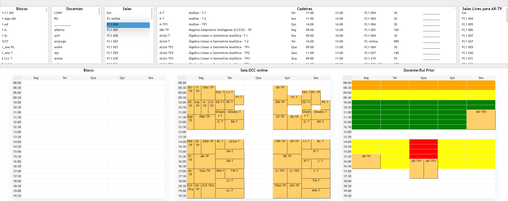

# schedule

An important practical application at FCUP concerns the preparation of weekly timetables for students, professors and rooms. There is an application being used at DCC for this, but the interface is rather poor, making timetable preparation a painful task.  The aim of this project is to provide a well designed graphical users interface for timetabling, with the specific application at FCUP in view.  Usability should be enlarged for all the departments, with swift resource sharing.  Ideally, this project will deliver a complete prototype.



## Dependencies

[](https://elm-lang.org/)

__[elm-land](https://github.com/elm-land)__ 
 

## Dev Server

```bash
SERVER_URL=$SERVER_URL elm-land server  # starts this app at http:/localhost:1234
``` 
`SERVER_URL`= Url of the backend host + api entrypoint e.g. https://192.168.1.217:8008/api/v1/

## Production

Build the application
```bash
SERVER_URL=$SERVER_URL elm-land build
```
`SERVER_URL`= Url of the backend host + api entrypoint e.g. https://192.168.1.217:8008/api/v1/

Output is stored in the `dist/` directory.

### Example with npm http-server

```bash
http-server dist/ --port 8080 -P "http://localhost:8080?" 
```